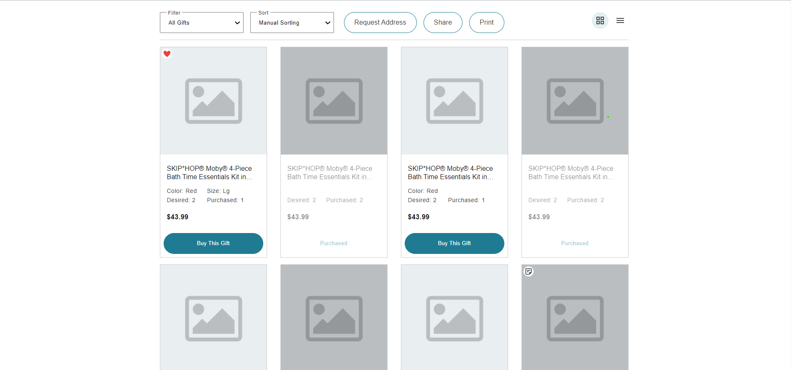

# grid-list-tech-assessment

## Design mockup:

## Final Website:

# # Organization:

1. set up files
2. do html markup
3. do css styling normally in style.css
4. analyze sizes of typography and make those variables
5. analyse sizes of spacing and make those variables
6. make colours variables
7. styling with css only layout - no color
8. make layout responsive
9. style color
10. push what is left
11. deploy with netlify
12. Add ss of original design in README
13. Add description of the task in README

## Optmizations:

Use LESS or SASS for making typography styles mixings
so they are more maintanable